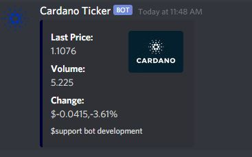

# The Cardano ADA Ticker Bot

The Cardano ADA Ticker Bot is meant to just showcase the latest price

[Invite the bot to your server!](https://discordapp.com/oauth2/authorize?client_id=824648378511917096&scope=bot&permissions=0) 



## Installation

Download [nodejs](https://nodejs.org/en/download/)

Clone repository

```bash
git clone https://github.com/f00d4tehg0dz/Cardano-ADA-Discord-Bot.git
```
cd into directory and run 

```bash
npm install
```

to start just do 

```bash
node index.js
```

## Usage

```bash
$ada
$support
```

## Contributing
Pull requests are welcome. For major changes, please open an issue first to discuss what you would like to change.

Please make sure to update tests as appropriate.

## License
[MIT](https://choosealicense.com/licenses/mit/)
